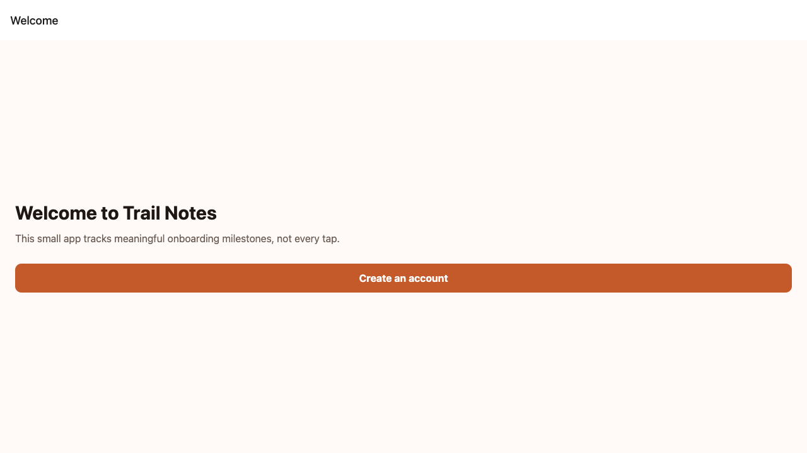

# OnRamp React Native + Expo onboarding example

A small, runnable Expo app that demonstrates a real three-step onboarding flow using [`@onramp-sdk/react-native`](https://www.npmjs.com/package/@onramp-sdk/react-native).

It initialises OnRamp once, tracks `account_created`, `profile_completed`, and `first_trail_saved`, identifies the user after profile completion, adds useful breakdown properties, and captures screen transitions with `NavigationTracker`.



## Run it

```bash
cd examples/react-native-expo-onboarding
npm install
EXPO_PUBLIC_ONRAMP_API_KEY=onr_your_key npm start
```

Use an app key from **Settings** in your OnRamp dashboard. The app key is publishable; never put account-level secrets in an Expo environment variable.

After completing the flow, create a funnel in the dashboard using the three milestones in order. Navigation events remain available separately in session timelines and journey maps.

Learn more in the [React Native SDK documentation](https://getonramp.dev/docs/sdks/react-native), [Expo guide](https://getonramp.dev/docs/sdks/expo), and [onboarding tracking guide](https://getonramp.dev/blog/react-native-onboarding-analytics).
